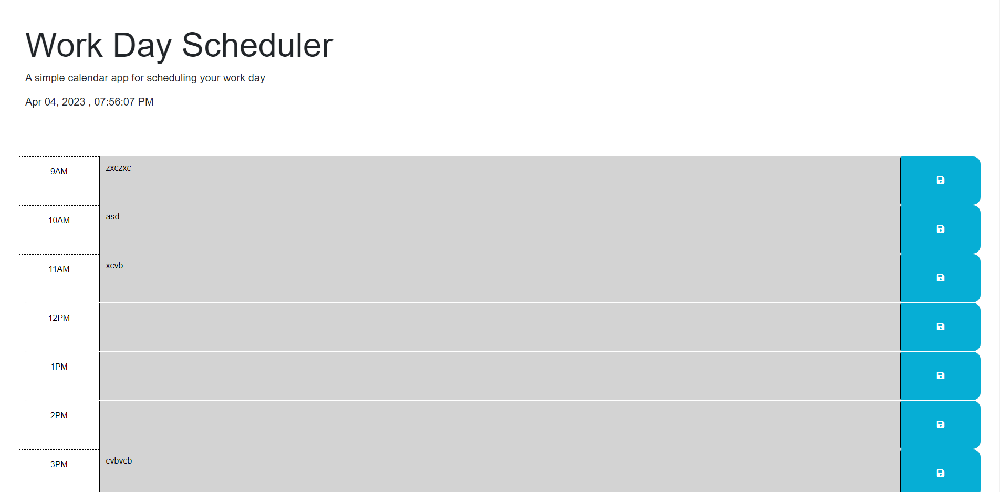

# Coding Quiz Challenge

## Description

This is the Module 5 Challenge for the boot camp. The code was made from scratch to allow the user to be able to create a daily schedule planner. It will allow the user to create or update task according to the time block they have selected. They are also able to save each task and be able to refresh the page without the task disappearing. Finally, the time blocks are color coded so the user can clearly tell which task that have already been passed, which task we are currently in, and which task are coming up.

Link to Deployment: https://jef1197.github.io/to-do-list/

## Usage

1. Currenty Day and time is listed at the top of the screen

2. Select a timeblock and create or update a task

3. You are able to save the task by clicking on the save button next to the time blocks

4. The time blocks will be color coded according to the current time. Grey -> Time has passed, Red -> Present Time, Green -> Future time

## License

Please refer to the LICENSE in the repo.